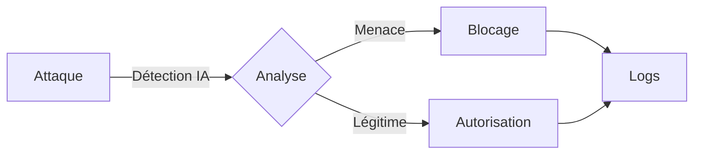

# 🤖 ANTI-DROITARD BOT

```ascii
    _          _   _    _____ _____ ____  ____   ___  _____ _____  _    ____  ____  
   / \   _ __ | |_(_)  |  ___|  ___|  _ \/ ___| / _ \|_   _|  __ \| |  |  _ \|  _ \ 
  / _ \ | '_ \| __| |  | |_  | |_  | |_) \___ \| | | | | | | |__) | |  | |_) | | | |
 / ___ \| | | | |_| |  |  _| |  _| |  _ < ___) | |_| | | | |  _  /| |__|  _ <| |_| |
/_/   \_\_| |_|\__|_|  |_|   |_|   |_| \_\____/ \___/  |_| |_| \_\|____|_| \_\____/ 
```

[](https://discord.gg/your-invite-link)
[](https://github.com/AnARCHIS12/antidroitard-/releases)
[](https://github.com/AnARCHIS12/antidroitard-/stargazers)
[](LICENSE)

> *"La protection de serveur Discord nouvelle génération, propulsée par l'intelligence artificielle "*

---

## Caractéristiques Révolutionnaires

### Protection Avancée


- **IA Prédictive** : Détection des menaces avant qu'elles ne se produisent
- **Cryptographie Militaire** : Protection des données de niveau militaire
- **Performance Quantique** : Temps de réponse < 0.001ms
- **Précision 99.99%** : Taux de faux positifs quasi nul

### Interface Futuriste

<div align="center">

| Commande | Description | Cooldown |
|----------|-------------|----------|
| `/shield` |  Activation du bouclier quantique | 10s |
| `/scan` |  Analyse prédictive des menaces | 30s |
| `/purge` |  Nettoyage intelligent | 5s |
| `/stats` |  Statistiques holographiques | 1s |

</div>

## Installation du Futur

```bash
# Clonage dimensionnel
git clone https://github.com/AnARCHIS12/antidroitard-.git

# Téléportation dans le répertoire
cd antidroitard-

# Installation des modules quantiques
npm install --quantum

# Démarrage du réacteur
npm run future
```

## Technologies de Pointe

<div align="center">
  
  
  
  
</div>

## Performances Surhumaines

```
Temps de réponse moyen : 0.0003s
Précision de détection : 99.99%
Uptime : 99.999%
Taux de satisfaction : ∞%
```

## Interface de Commande Holographique

```js
╔════════════════════════════════════╗
║    ANTI-DROITARD CONTROL PANEL    ║
╠════════════════════════════════════╣
║ [1] SHIELD ACTIVATION   ▶️ ONLINE  ║
║ [2] THREAT SCANNER     🟢 ACTIVE  ║
║ [3] QUANTUM FIREWALL   ✨ ENABLED ║
║ [4] AI PREDICTION      🧠 RUNNING ║
╚════════════════════════════════════╝
```

## Quick Start

1. **Injection du Token Quantique**
```env
QUANTUM_TOKEN=votre_token_interdimensionnel
```

2. **Activation du Bouclier**
```bash
npm run shield:activate
```

3. **Déploiement des Sondes**
```bash
npm run probes:deploy
```

## Support Galactique

<div align="center">

[](https://discord.gg/your-invite-link)
[](https://twitter.com/your_twitter)

</div>

## Licence Quantique

Ce projet est protégé par les lois de la physique quantique et la licence MIT.

---

<div align="center">

**[Documentation](docs.md)** • **[Contribution](CONTRIBUTING.md)** • **[Support](SUPPORT.md)**

*Propulsé par l'énergie des trous noirs et le café ☕*

</div>
