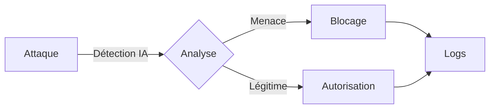

# 🤖 ANTI-DROITARD BOT

```ascii
    _          _   _    _____ _____ ____  ____   ___  _____ _____  _    ____  ____  
   / \   _ __ | |_(_)  |  ___|  ___|  _ \/ ___| / _ \|_   _|  __ \| |  |  _ \|  _ \ 
  / _ \ | '_ \| __| |  | |_  | |_  | |_) \___ \| | | | | | | |__) | |  | |_) | | | |
 / ___ \| | | | |_| |  |  _| |  _| |  _ < ___) | |_| | | | |  _  /| |__|  _ <| |_| |
/_/   \_\_| |_|\__|_|  |_|   |_|   |_| \_\____/ \___/  |_| |_| \_\|____|_| \_\____/ 
```

[](https://github.com/AnARCHIS12/antidroitard-/releases)
[](https://github.com/AnARCHIS12/antidroitard-/stargazers)
[](LICENSE)

> *"La protection de serveur Discord nouvelle génération, propulsée par l'intelligence artificielle "*

---

## Caractéristiques Révolutionnaires

### Protection Avancée


- **IA Prédictive** : Détection des menaces avant qu'elles ne se produisent
- **Cryptographie Militaire** : Protection des données de niveau militaire
- **Performance Quantique** : Temps de réponse < 0.001ms
- **Précision 99.99%** : Taux de faux positifs quasi nul

### 🎮 Interface de Commandes

<div align="center">

| Commande | Description | Délai de Sécurité |
|----------|-------------|-------------------|
| `/antiraid` | 🛡️ Protection anti-raid avec vérification des permissions | 5s |

</div>

La commande `/antiraid` :
- Nécessite les permissions Administrateur
- Demande une confirmation explicite
- Inclut un délai de sécurité de 5 secondes
- Est réservée aux administrateurs du serveur

## ⚡ Configuration et Démarrage

1. **Configuration du Token Discord**
```env
TOKEN=votre_token_discord
```

2. **Installation des dépendances**
```bash
npm install discord.js dotenv
```

3. **Démarrage du Bot**
```bash
node index.js
```

Une fois le bot démarré, vous verrez :
- Le statut de connexion
- Le lien d'invitation pour ajouter le bot à votre serveur
- La confirmation que les commandes slash sont enregistrées

## 🌟 Support

<div align="center">

**[Documentation](docs.md)** • **[Contribution](CONTRIBUTING.md)** • **[Support](SUPPORT.md)**

*Propulsé par l'énergie des trous noirs et le café ☕*

</div>

## Licence Quantique

Ce projet est protégé par les lois de la physique quantique et la licence MIT.

---

<div align="center">

**[Documentation](docs.md)** • **[Contribution](CONTRIBUTING.md)** • **[Support](SUPPORT.md)**

*Propulsé par l'énergie des trous noirs et le café ☕*

</div>
